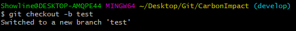
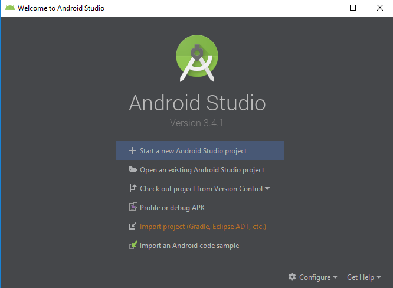
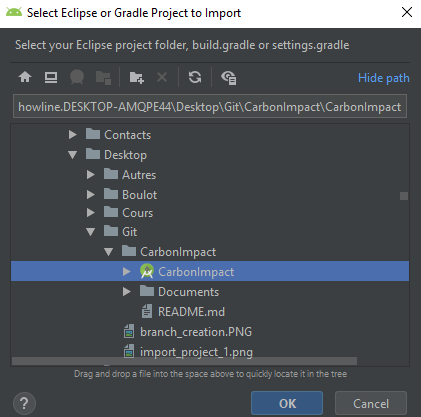

## 1] Créer une nouvelle branche
Pour créer une nouvelle branche, il faut aller dans la branche parent avec un `git checkout`. Dans l'exemple, la branche parent est `develop` :
```
git checkout develop
```

Puis tu crées une nouvelle branche avec le nom souhaité
```
git checkout -b test
```

```
Tu remarqueras qu'après cette commande, tu te retrouves dans ta nouvelle branche. Il en existe une autre qui crées juste la branche, mais je te mets celle-là car souvent, quand tu crées une branche, c'est que tu vas l'utiliser juste après.

Après, tu peux faire toutes les modifications que tu souhaites, puis tes commits et tes push, comme sur master.

Si, entre temps, tu veux changer de branche, cela se fait avec `git checkout <nom_de_la_branche>`. Par exemple, si on veut retourner à `develop`, on utilise :
```
git checkout develop
```

## 2] Import du projet dans Android Studio



